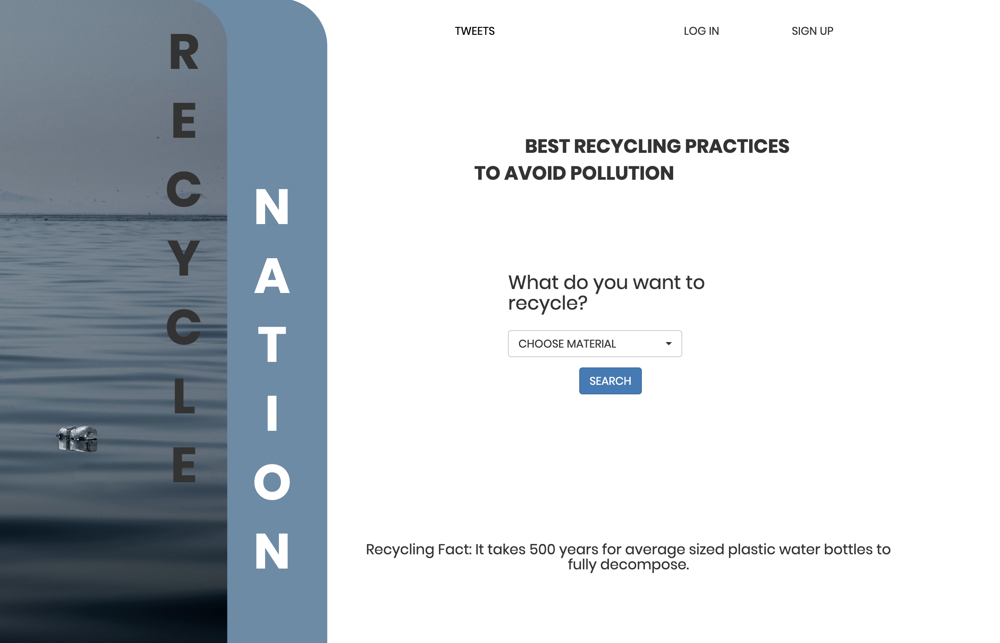
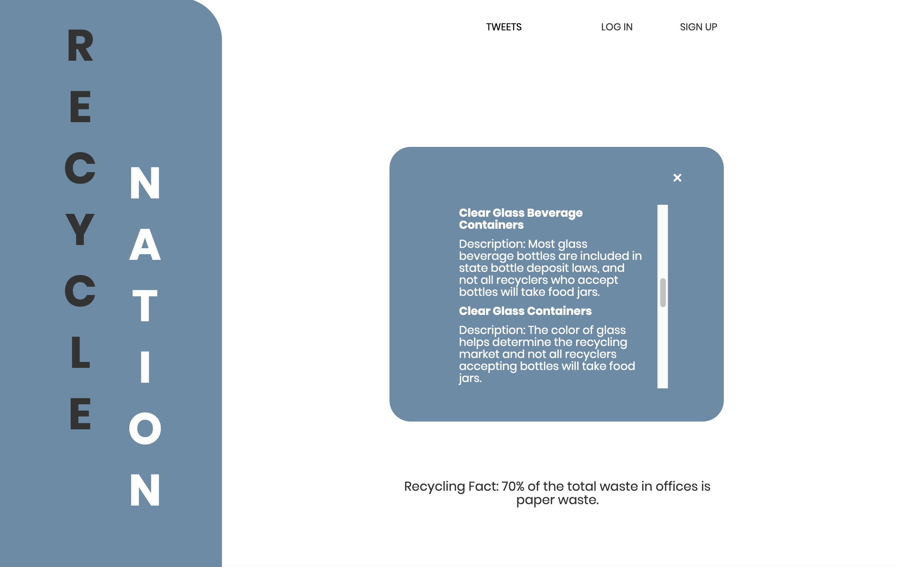
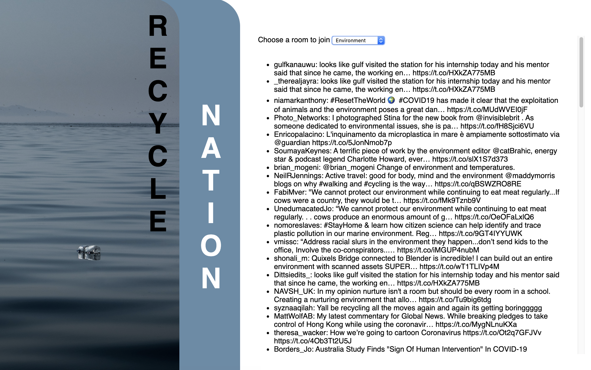

# Recycle Nation
An app that tells you what to recycle and what people around the world are saying about environmental issues.

## Description

The average person doesn't know the basics of recycling. This app will tell you how and where to easily recycle everything from newspapers to plastic bottles to computer equipment. In addition to providing useful information about recycling, there will be a place to chat with other recyclers.

## User Story

Persona: Reese

She is 25, single and very busy. She is a grad student and works full time. She cares about the environment and the future of the world but doesn't have time to work out the fundamentals of recycling.

## Built With 

•   Javascript
•   Express
•   HandleBars
•   MySQL
•   Socket.io
•   Sequelize
•   NodeJS
•   Axios

## Getting Started

To run on your local computer clone the SSH key to your local drive. Open with a terminal bash and run the following commands

npm init -y

npm install 

This will download all the dependencies including axios, handlebars, express, and mySQL. Once installed hit the following command to run the application. 

npm run seeds.csv

npm run server

### Prerequisites

NodeJS
Terminal/Bash
Source Code Editor
MySQL
mySQLWorkbench

## Team

Juju  |  Sasha  |  Alex  | Chris

## Deployed

https://intense-thicket-33780.herokuapp.com/
